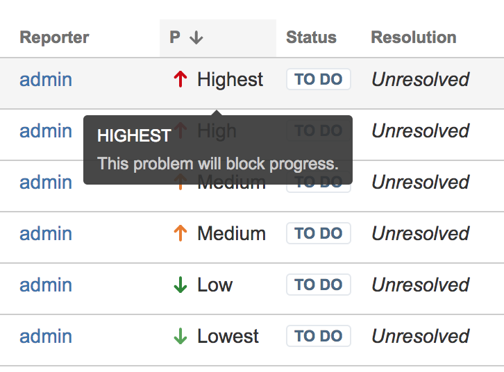

### Background
This simply adds a 'label' to the Priority column of the Jira Issue Navigator.

### Links
* [Installable OBR file](https://bitbucket.org/sfbehnke/navigator-priority-prettytext/downloads/navigator-priority-prettytext-1.0.0.obr)
* [Standalone script](https://bitbucket.org/sfbehnke/navigator-priority-prettytext/downloads/standaloneScript.js)

### Description
Normally Jira represents the column for Priority simply with an icon. It may be more desirable to have a label. This
plugin adds it in a simple manner with some javascript.



It was written for Jira 7.7.1.

### Technical bits
This is a Jira plugin. This simply defines a web-resource plugin module with a javascript file and a css file.

```
<web-resource key="${project.artifactId}-resources" name="${project.name} Web Resources">
    <dependency>com.atlassian.auiplugin:ajs</dependency>

    <resource type="download" name="priorityTextStyles.css" location="/css/priorityTextStyles.css"/>
    <resource type="download" name="issueNavigatorMutateIssueRow.js" location="/js/issueNavigatorMutateIssueRow.js"/>
    <resource type="download" name="images/" location="/images"/>

    <context>jira.navigator.simple</context>
    <context>jira.navigator.advanced</context>
</web-resource>
```
